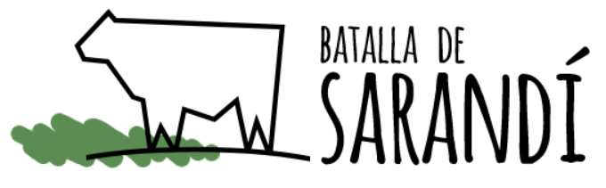
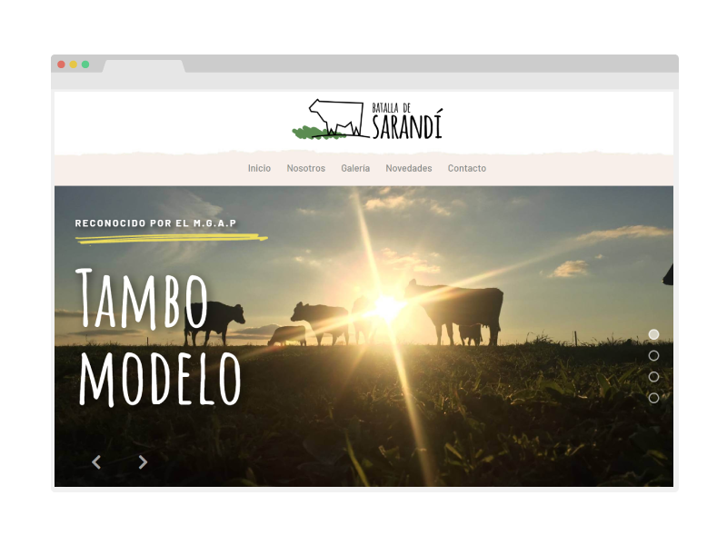

<div id="top"></div>

<!-- PROJECT LOGO -->
<br />
<div align="center">
  <a href="https://github.com/lopezrunco/batalla-sarandi-nextjs">
    
  </a>

<h3 align="center">batalla-sarandi-nextjs</h3>

  <p align="center">
    Website of a familiar milk farm business built in Next.js
    <br />
    <a href="https://batalla-de-sarandi.web.app/">View Demo</a>
    <br />
    <br />
  </p>
</div>


<!-- TABLE OF CONTENTS -->
<details>
  <summary>Table of Contents</summary>
  <ol>
    <li>
      <a href="#about-the-project">About The Project</a>
      <ul>
        <li><a href="#built-with">Built With</a></li>
      </ul>
    </li>
    <li>
      <a href="#getting-started">Getting Started</a>
      <ul>
        <li><a href="#prerequisites">Prerequisites</a></li>
        <li><a href="#installation">Installation</a></li>
      </ul>
    </li>
    <li><a href="#contributing">Contributing</a></li>
  </ol>
</details>


<!-- ABOUT THE PROJECT -->
## About The Project



This is a corporate website based on Next.js that you can easily reuse changing the images, logo and main colors.

<p align="right">(<a href="#top">back to top</a>)</p>


### Built With


<p align="right">(<a href="#top">back to top</a>)</p>


<!-- GETTING STARTED -->
## Getting Started

### Prerequisites

* node.js
* npm

### Installation

1. Clone the repo
   ```sh
   git clone https://github.com/lopezrunco/batalla-sarandi-nextjs.git
   ```
2. Install NPM packages
   ```sh
   npm install
   ```
3. Generate .env file with the public url
   ```sh
   NEXT_PUBLIC_URL = https://example.com.uy
   ```
4. Run development server
    ```sh
    npm run dev
    ```

<p align="right">(<a href="#top">back to top</a>)</p>


<!-- CONTRIBUTING -->
## Contributing

Contributions are what make the open source community such an amazing place to learn, inspire, and create. Any contributions you make are **greatly appreciated**.

If you have a suggestion that would make this better, please fork the repo and create a pull request. You can also simply open an issue with the tag "enhancement".
Don't forget to give the project a star! Thanks again!

<p align="right">(<a href="#top">back to top</a>)</p>
